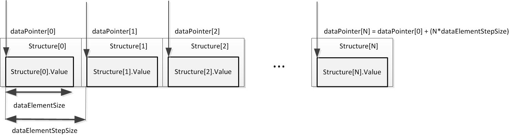
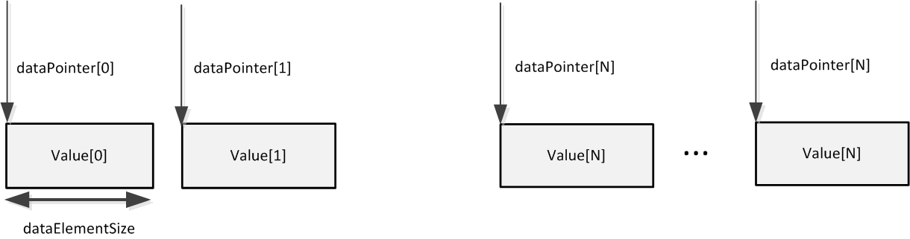

----

# The Awa Static API

## Introduction  
A constrained device is an IoT node device which is severely limited in terms of power, memory, processing speed and/or connectivity, usually having insufficient resources to safely connect to the internet. A typical example may be something a simple as a remote temperature sensor with strictly defined functionality and a dedicated task. Constrained devices will usually connect to external services via a more powerful gateway device.

The management of constrained devices requires efficient lightweight protocols specifically designed for small code footprint, highly optimised data models and minimal processing requirements. The Open Mobile Alliance's LWM2M, which is built on the Constrained Application Protocol (CoAP), a specialized web transfer protocol for use with constrained nodes and constrained networks, is an ideal management and communication solution for resource limited devices.

## The Awa LightweightM2M client
The Awa LightweightM2M client is a small footprint LWM2M client implementation written in C. Its purpose is to abstract LWM2M functionality while integrating the required data structures with the device's main application code. All Awa LightweightM2M client functionality is accessed via the **Awa Static API**, which provides an interface between a constrained device's application code and LWM2M Client services.
 

 
 
The Awa Static API is ideally suited to devices that have a fixed configuration and dedicated functionality. It provides a concise solution that enables the C data structures in the device application code to be directly accessed by the LWM2M Client.
 
## Basic LWM2M Client functionality  
Device bootstrapping and server registration are performed automatically by the LWM2M Client. Object and Resource models are defined on the client side and then registered with the LWM2M Server. 

### Device bootstrapping
The device application needs to be pre-configured with bootstrap server credentials. On power up the device contacts the bootstrap server and is provided with alternative credentials suitable for registration with a management server. Management server data is provided as an IPSO server Object. The Awa LightweightM2M client handles the LWM2M bootstrapping process without the need for any application code. All that's required are the bootstrap server details.

*Note that since there is no mechanism in the Static API to verify that the LWM2M management server URL provided by the bootstrap server is correct, the bootstrap server must be trusted.*

### Registration  
Device registration with the LWM2M management server is fully abstracted and automated. No supporting application code is needed.

### Device management  
Device management is supported by appropriate Object definitions. IPSO Object definitions are supported and custom objects can also be defined.

### Information reporting
The LWM2M Client supports the CoAP *Observe* operation. Observations are handled by the Client, but the application code must first notify the Client if a Resource value has changed.

### Operation  
The majority of LWM2M operations happen 'under the hood' of the LWM2M Client. The device application code interacts with the Client via the Static API.

Data are shared between the application code and the LWM2M client using pre-defined or custom Objects and Resources as described in the OMA LWM2M specification. Any server or management application that interacts with the device application must be aware of the Client's data model and have definitions for the same Objects and Resources to facilitate interoperability. It is recommended that OMA registered IDs are used that conform to registered LWM2M or IPSO objects.
Since an Object is a container for a set of related Resources, an Object must be defined prior to the Resources associated with it.
Objects and Resources are defined in one of two ways:
* **Pointer Mode** - Objects and Resources are defined in application memory and accessed via pointers which are registered with the LWM2M Client via the Static API.  
* **Handler Mode** - Objects and Resources are defined by a handler function. Object and Resource memory is not directly accessible to the application code. Resource value operations are passed to the Resource handler for execution and any response values are returned by the handler to the application code.  

While either of the above modes may be used to manage Objects and Resources, the mode may not be changed once an Object has been defined. For example, Object Resources defined via handler mode cannot then be accessed or modified using pointer mode operations.

#### Summary points for pointer and handler modes:  
**Pointer Mode**
* Objects are defined as a simple container for resources.  
* Allows integration of existing C data structures with the LWM2M service.  
* Application memory is shared and exposed to the Client through pointers registered using the API.  
* Data access is automatic - LWM2M will read and write memory as required.  
* Allows for concrete data structures that are laid out in application memory in a static manner.  
* Works best for existing data structures.  
* Easier to use than handler mode, but less flexible because data has to be laid out in a static way.  

**Handler Mode**  
* Objects and associated Resources are defined with a handler function.
* All resources defined within a handled object must also be defined with handlers.
* Uses callbacks to notify the application of a pending LWM2M operation. Callbacks are responsible for constructing a response.
* Memory is not shared. Data access is handled by the application - LWM2M will request operations and the application responds.
* Allows for virtual data structures, and data structures that are logically constructed in real time, such as calculating velocity from change in position over time, and exposing the result as a resource calculated on request.
* Works best for resources that require logic or calculations to access.
* More involved to use than pointer mode, (more code required), but more flexible because it provides the application with the opportunity to modify values on the fly, effectively offering virtual Resources.
 
### Detailed functionality

>Sequence of operations (init, definition, start, process loop)
>init: configuring CoAP, endpoint name, bootstrap URI
>definition: setting up pointer and/or handler definitions for each object
>start: initialises CoAP (allows CoAP endpoints to be created)
>process loop: client-side create/delete, update values, generate notifications, handle LWM2M operations and bootstrap/register.
>Explain min/maxInstances in definition functions.
>Notification hierarchy explanation?

 - [x] Explain AwaResourceOperations and how they affect resource access.


#### Resource definition

Resources are defined with properties according to the LWM2M specification, and must be associated with a parent Object. Use AwaStaticClient_DefineResource to define a new resource within an existing object:
````
AwaError AwaStaticClient_DefineResource(AwaStaticClient * client, AwaObjectID objectID, AwaResourceID resourceID, const char * resourceName, AwaResourceType resourceType, uint16_t minimumInstances, uint16_t maximumInstances, AwaResourceOperations operations)
````

 - [x] Explain these parameters.

The parameter **maximumInstances** specified in the earlier call to AwaStaticClient_DefineResource specifies the number of values (N) stored in memory.

When a multiple instance resource is created that was defined using the pointer method, the number of resource instances that exist in that resource will be the *maximumInstances* value used in the resource definition.

*Note that the maximumInstances parameter defines a resource as being single (maximumInstances = 1) or multiple instance (maximumInstances > 1) whereas the minimumInstances parameter determines whether a resource is mandatory (minimumInstances = 1) or optional (minimumInstances = 0)*

#### Pointer mode
Pointer mode defines Resource Instances in specific memory locations. The specified memory locations may be either *uniform* (of fixed length and contiguous spacing) or *sparse* (fixed length but not contiguous spacing).

##### Uniform resource distribution
Where fixed length resource instances are defined contiguously in memory only the start point and the element size values are required to calculate the location of any resource instance value in the set.
Use the AwaStaticClient_SetResourceStorageWithPointer prototype to specify resource instance values located uniformly in memory as below:
```` 
AwaError AwaStaticClient_SetResourceStorageWithPointer(AwaStaticClient * client, AwaObjectID objectID, AwaResourceID resourceID, void * dataPointer, size_t dataElementSize, size_t dataStepSize)
````
This results in fixed length resource instances being distributed continuously in memory as shown below:
 


The parameters of the above function used to provide information about the location of each value in memory as shown in the diagram above are:   
* **dataPointer** - the value of the start point (dataPointer[0] in the diagram)  
* **dataElementSize** - the size of an individual value in bytes  
* **dataStepSize** - the number of bytes between values  

From the above parameters the location of any array element, dataPointer[N], can be derived. In terms of LWM2M, the element number *N* is the resource instance ID.
 
##### Sparse resource distribution

In this case, because the resource instance values will not be contiguous or evenly distributed in memory, the location of each value must be explicitly stated as a set of pointer values passed in an array to the *AwaStaticClient_SetResourceStorageWithPointerArray* function.

The prototype for specifying a set of resource instance values that are located sparsely in memory is:
 
```` 
AwaError AwaStaticClient_SetResourceStorageWithPointerArray(AwaStaticClient * client, AwaObjectID objectID, AwaResourceID resourceID, void * dataPointers[], size_t dataElementSize)
````
 
This results in fixed length resource instances being distributed arbitrarily in memory as shown below:
 


The parameters that provide information about the location of each value in memory as shown in the diagram above are:
* **dataPointers** - an array (of size N) of pointers to the values  
* **dataElementSize** - the size of an individual value in bytes  


#### Handler mode

Handler mode gives a low level control of both object and resource instances. A generic handler is used for handling LWM2M object and resource operations. Since handler functionality is determined parametrically some handler parameters may or may not be required, depending on the operation.  
The prototype for the handler callback function is shown below:  
````
typedef AwaResult(*AwaStaticClientHandler )(AwaStaticClient *client, AwaOperation operation, AwaObjectID objectID, AwaObjectInstanceID objectInstanceID, AwaResourceID resourceID, AwaResourceInstanceID resourceInstanceID, void **dataPointer, size_t *dataSize, bool *changed)
````

The parameters required for handling operations on object and resource instances are described below.  

##### Handler mode for Objects
*AwaStaticClient_SetObjectOperationHandler* specifies a handler function that is called when a LWM2M operation is performed on an object. The table below lists the object operations that trigger the handler function.
 
| operation | objectID | objectInstanceID | resourceID | resourceInstanceID | dataPointer | dataSize | changed | returns |
|-----|-----|-----|-----|-----|-----|-----|-----|-----|
| *AwaOperation_CreateObjectInstance*  Creates an instance of a previously defined object. | Object ID from definition with *AwaStaticClient_DefineObjectWithHandler* | Object Instance ID of object to create | not used (AWA_INVALID_ID) | not used (AWA_INVALID_ID) | not used (NULL) | not used (NULL) | not used (NULL) | *AwaResult_SuccessCreated*  when object instance is created successfully  TODO: error codes |
| *AwaOperation_DeleteObjectInstance*  Deletes an existing object instance | Object ID from definition with *AwaStaticClient_DefineObjectWithHandler* | Object Instance ID of object to delete | not used (AWA_INVALID_ID) | not used  (AWA_INVALID_ID) | not used (NULL) | not used (NULL) | not used (NULL) | AwaResult_SuccessDeleted when object instance is deleted successfully  TODO: error codes |

##### Handler mode for Resources  

*AwaStaticClient_SetResourceOperationHandler* specifies a handler function that is called when LWM2M operations are performed on a resource. The table below lists the resource operations that trigger the handler function.
 
| operation | objectID | objectInstanceID | resourceID | resourceInstanceID | dataPointer | dataSize | changed | returns |
|-----|-----|-----|-----|-----|-----|-----|-----|-----|
| *AwaOperation_CreateResource* | Object ID from definition with *AwaStaticClient_DefineResourceWithHandler* | Object Instance ID of object |	Resource ID from definition with *AwaStaticClient_DefineResourceWithHandler* | not used  (AWA_INVALID_ID) | not used (NULL) | not used (NULL) | not used (NULL) | *AwaResult_SuccessCreated* when a resource is created successfully TODO: error codes |
| *AwaOperation_DeleteResource* | Object ID from definition with *AwaStaticClient_DefineResourceWithHandler* | Object  Instance ID of object | Resource ID from definition with *AwaStaticClient_DefineResourceWithHandler* | not used  (AWA_INVALID_ID) | not used (NULL) | not used (NULL) | not used (NULL) | *AwaResult_SuccessDeleted* when resource is deleted successfully TODO: error codes |
| *AwaOperation_Read* | Object ID from definition with *AwaStaticClient_DefineResourceWithHandler* | Object Instance ID of object | Resource ID from definition with *AwaStaticClient_DefineResourceWithHandler* | Resource Instance ID to Read a value from | Set to a pointer to the resource instance value | Set to the size of the resource Instance value | not used (NULL) | *AwaResult_SuccessContent*  when successful.  dataPointer and dataSize represent the resource instance.  TODO: error codes |
| *AwaOperation_Write* | Object ID from definition with *AwaStaticClient_DefineResourceWithHandler* | Object Instance ID of object | Resource ID from definition with *AwaStaticClient_DefineResourceWithHandler* |	Resource Instance ID to Write a value to | Has a pointer to the resource value that must be copied | Has the size of the resource value to be copied | *True* if the resource instance value has changed, *False* if the resource instance value has not changed | *AwaResult_SuccessChanged* when successful. Resource instance value set to *dataPointer* value. TODO: error codes |  
| *AwaOperation_Execute* | Object ID from definition with *AwaStaticClient_DefineResourceWithHandler* |	Object Instance ID of object |	Resource ID from definition with *AwaStaticClient_DefineResourceWithHandler* | Resource Instance ID to Execute | Has a pointer to the execute arguments | Has the size of the execute arguments | not used (NULL) | AwaResult_Success when successful.  TODO: error codes |


### Further information  

[Examples](http://flowm2m.github.io/AwaLWM2M-docs/examples.html)
 
[API Documentation](http://flowm2m.github.io/AwaLWM2M-docs/static_8h.html)
 
----


----

