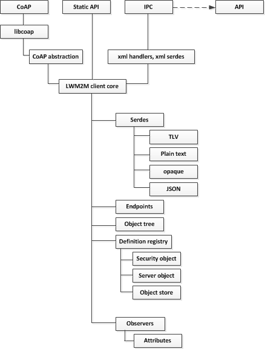

----

# Awa LightweightM2M.

## Developer guide.
This guide is intended for developers who aim to contribute to the Awa LightweightM2M project. Developers who intend only to use the Awa LightweightM2M tools in their own M2M applications are referred to the [Awa LightweightM2M user guide](userguide.md).

### Introduction.

OMA LightweightM2M (LWM2M) facilitates standardised communication between devices and management applications. LWM2M is built on a request/response protocol called Constrained Application Protocol (CoAP), which is similar to HTTP. A CoAP server hosts a number of resources that can be read from and written to by a CoAP client. LWM2M makes use of CoAP resources to group information into instances of standard and registry-defined objects which are defined to provide common device management functions such as location, software upgrades, and network configuration. As LWM2M operations are carried via CoAP requests, each request specifies an **endpoint** that corresponds to a particular resource.

LWM2M also provides a *bootstrap* mechanism, which helps a client to locate and connect to a management server in a secure manner. A trusted bootstrap server may be configured with appropriate security credentials for one or more management servers. Clients connecting to the bootstrap server are then provided with these credentials to enable registration with the relevant management server.

LWM2M makes use of an *Object/Object Instance/Resource* (OIR) model to represent information. Objects are constructed from individual resource definitions, and each instance of an object is called an *Object Instance*.

Refer to section [6.1 of the LWM2M technical specification](http://technical.openmobilealliance.org/Technical/technical-information/release-program/current-releases/oma-lightweightm2m-v1-0) for details.

Awa LightWeightM2M is an implementation of OMA LWM2M written in C. It incorporates both server and client functionality and provides APIs for both. Typically, the client or server runs as a standalone Linux process (a "daemon") and an application uses the API library to access and modify resources across an inter-process communication (IPC) interface. This decoupling of the API from the main functionality allows other languages to make use of the daemons by implementing the IPC protocol.

### License.
Awa LightWeightM2M source code is made available by Imagination Technologies Limited under the standard 3-clause BSD license described [here.](https://www.tldrlegal.com/l/bsd3)

### Contributing to Awa LightWeightM2M.
Contributions to the Awa LightweigthM2M project are welcome and there are many ways to help, by submitting bug reports for example, or making feature requests, code changes or documentation edits.
To ensure that the codebase remains easy to understand, maintain and improve, all contributions should adhere to the [coding style guide](coding_style.md).
A comprehensive collection of unit tests is being developed and maintained to ensure that new contributions do not break existing functionality. All code submissions should be accompanied by one or more relevant unit tests, implemented within the existing unit test framework as described in the [*Testing*](developer_guide.md#testing) section below.

For further details on contributing go [here](../CONTRIBUTING.md).

### Design overview.
This section provides information about the structure of the codebase and how the components interact.

The codebase is divided into the following parts:

 * Client
 * Server
 * Bootstrap server
 * API

The Client, Server and Bootstrap server are implemented as Linux processes. Typically these run as *daemons*, detached from a parent console, which may be configured to automatically run when the host starts up. For example, a Linux gateway may automatically start the server so that constrained devices are able to register as soon as the gateway becomes available.

The API is provided as a linkable library, to be incorporated into a user program. It has three parts:

 * Client API
 * Static client API
 * Server API

The client and server APIs are for the less constrained devices (running Linux), to use to interact with local daemons. They provide a way to dynamically define objects, which is useful for gateway devices that need to adapt to an application's needs.

The Static client API is designed for cases where the configuration will not change during the lifetime of the software. Typical use cases are constrained devices (which are severely resource limited) and the use of Standard Objects (as defined by the LWM2M specification), which are not expected to change.

### The client.
The client consists of the *client core*, which coordinates the IPC layer (for communication with the client API), the static API, serialiser/deserialiser (*serdes*), CoAP, definition registry, data storage (*object tree*) and observer registry.

#### The client core.

The core is the layer that pulls all of the components together. It defines a number of functions called to handle requests from the CoAP layer, static API and the IPC interface.

When a CoAP request is received, the *Lwm2mCore_HandleRequest()* function is called. This function locates the required endpoint and calls the associated handler function. For most endpoints this will be the *Lwm2mCore_DeviceManagmentEndpointHandler()* which maps the CoAP GET/PUT/POST request onto a LWM2M operation and calls the appropriate *request handler*. For example, a GET request may be mapped to a LWM2M READ operation and the *Lwm2mCore_HandleGetRequest()* function will be called to perform the operation.

The operation handler function (e.g. Lwm2mCore_HandleGetRequest) utilises several other components:
* The definition of the requested resource is looked up in the *definition registry*.
* The *object tree* is used to implement the OIR data model and determines whether the requested endpoint exists.

Additionally, an access control check is made to ensure that the requested operation is permitted. If so, and if a valid definition is found, the resource's *read* handler will be called.

Most resource read/write handlers are handled by the object store which acts as a generic storage mechanism. The standard server and security objects each have their own specialised handlers.

#### The definition registry.

The definition registry stores definitions for all objects and resources within the system.

There are two types of definition:
* **The resource definition**, which defines a single resource that acts as a container for a LWM2M data type.
* **The object definition**, which may contain one or more resource definitions, holds information such as whether multiple instances of the object can be created, or whether an object instance is *mandatory* or *optional*, and may contain various function pointers which map its operations (Write/Read etc) onto the appropriate handlers.

*Note that defining a resource does not instantiate it. A resource does not exist until its parent object is instantiated.*

#### The CoAP abstraction layer.
The CoAP abstraction layer hides the specifics of a CoAP library's interface and provides a common interface that can be used by the core.

#### Serdes.
There is a serialiser and deserialiser (serdes) for each of the data formats supported by the LWM2M protocol and implemented by Awa LightweightM2M. The supported data formats are:

 * Plain Text
 * TLV
 * JSON
 * Opaque

The serialiser converts data from a Lwm2mTree, constructed from Lwm2mTreeNode elements, into a format suitable for transmission by LWM2M.  The deserialiser converts data from a LWM2M format into a Lwm2mTree.

#### The object store.

TODO

#### The object tree.

The object tree implements the LWM2M OIR data model by keeping track of all objects, object instances, resources and resource instances in the system. It encapsulates this information so that other components, such as lower level handlers (i.e security object handler, server object handler), do not need to know about the higher-level data structure. It only stores structural information regarding the data model - any resource-specific information is managed by lower-level handlers and the object store.

#### Observers.

TODO

#### Endpoints.

TODO

#### IPC.

Applications may communicate with the LWM2M Client and Server daemons through the use of UDP-based IPC. This is a simple XML-based request/response mechanism that enables the API to initiate LWM2M operations on the Server, and manage LWM2M resources on the Client.

In addition, a Notification channel is set up that enables asynchronous reception of Notifications, including those related to LWM2M Observations, and Server Events such as Client Registration.

The IPC XML format is documented in [IPC](doc/ipc.md).

##### IPC Handlers.

When IPC messages are received by the API or a Daemon, handler functions are invoked to extract the content and pass it either up through the API, or down into the Core.

### Server.

(** ADD DIAGRAM **)

TODO

#### Server Core

TODO

****** What other sections do we need here? *****

### The Bootstrap server

(** ADD DIAGRAM **)

TODO

#### Bootstrap configuration.

TODO

****** What other sections do we need here? *****

## Building

Refer to ...

TODO

## Testing.

Awa LightweightM2M was developed alongside a comprehensive test suite, implemented within the Google Test framework. Tests are written in C++ and compile as part of one of several "test runner" applications:

 * test_core_runner executes tests related to Client and Server daemon components.
 * test_api_runner executes tests related to Client and Server API components, including top-level tests involving multiple daemons.

TODO

## Best Practices

TODO

## FAQ

TODO
