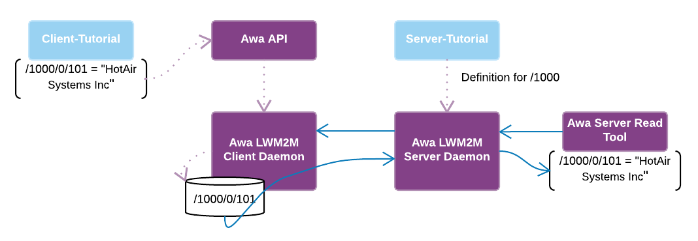

----

# Awa LightweightM2M.

## Writing your own client application using the Awa API.


Before we can start, Awa LWM2M must first be compiled and installed,
the commands below can be used to build and install Awa LWM2M to ./build/install

```
~/AwaLWM2M$ make
~/AwaLWM2M$ cd build
~/AwaLWM2M/build$ cmake DESTDIR=./install install
```

Create a new directory for your project, in this case we will use "tutorial":

```
$ mkdir ~/tutorial
$ cd ~/tutorial
```

Copy the code below to tutorial/Makefile:

*note: make sure to retain the <TAB> character preceding "$(CC) client-tutorial.c"*

```make
INSTALL_PATH:=~/AwaLWM2M/build/install

all:
	$(CC) client-tutorial.c -o client-tutorial -I $(INSTALL_PATH)/usr/include -L $(INSTALL_PATH)/usr/lib -lawa
```

Copy the code below to tutorial/client-tutorial.c:

```c
#include <stdlib.h>
#include <stdio.h>

#include <awa/common.h>
#include <awa/client.h>

#define OPERATION_PERFORM_TIMEOUT 1000

static void DefineHeaterObject(AwaClientSession * session)
{
    AwaObjectDefinition * objectDefinition = AwaObjectDefinition_New(1000, "Heater", 0, 1);
    AwaObjectDefinition_AddResourceDefinitionAsString(objectDefinition, 101, "Manufacturer", false, AwaResourceOperations_ReadWrite, NULL);

    AwaClientDefineOperation * operation = AwaClientDefineOperation_New(session);
    AwaClientDefineOperation_Add(operation, objectDefinition);
    AwaClientDefineOperation_Perform(operation, OPERATION_PERFORM_TIMEOUT);
    AwaClientDefineOperation_Free(&operation);
}

static void SetInitialValues(AwaClientSession * session)
{
    AwaClientSetOperation * operation = AwaClientSetOperation_New(session);

    AwaClientSetOperation_CreateObjectInstance(operation, "/1000/0");
    AwaClientSetOperation_CreateOptionalResource(operation, "/1000/0/101");
    AwaClientSetOperation_AddValueAsCString(operation, "/1000/0/101", "HotAir Systems Inc");

    AwaClientSetOperation_Perform(operation, OPERATION_PERFORM_TIMEOUT);
    AwaClientSetOperation_Free(&operation);
}

int main(void)
{
    AwaClientSession * session = AwaClientSession_New();

    AwaClientSession_Connect(session);

    DefineHeaterObject(session);
    SetInitialValues(session);

    AwaClientSession_Disconnect(session);
    AwaClientSession_Free(&session);
    return 0;
}
```

Build your new application:

```
~/tutorial$ make INSTALL_PATH=~/AwaLWM2M/build/install
```

Start the client daemon:

````
~/AwaLWM2M$ build/core/src/client/awa_clientd --endPointName client1 --factoryBootstrap ./core/bootstrap-localhost.config --daemonise --logFile /tmp/awa_clientd.log
````

Run your application:

*Note: in this case libawa.so isn't in the library path, so we will tell the system where to find
 it by setting the LD_LIBRARY_PATH variable.*
```
~/tutorial$ LD_LIBRARY_PATH=~/AwaLWM2M/build/install/usr/lib ./client-tutorial
````

At this point your application will exit, leaving your new object/resource registered within the client daemon.

Use the client tools to read your newly defined resource:

```
~/AwaLWM2M/build/install/bin$ ./awa-client-get /1000/0/101
Heater[/1000/0]:
    Manufacturer[/1000/0/101]: HotAir Systems Inc
```

## Extending the tutorial

```c
static void DefineHeaterObject(AwaClientSession * session)
{
    AwaObjectDefinition * objectDefinition = AwaObjectDefinition_New(1000, "Heater", 0, 1);
    AwaObjectDefinition_AddResourceDefinitionAsString(objectDefinition, 101, "Manufacturer", false, AwaResourceOperations_ReadWrite, NULL);
+   AwaObjectDefinition_AddResourceDefinitionAsFloat(objectDefinition,  104, "Temperature", false, AwaResourceOperations_ReadWrite, 0.0);

    AwaClientDefineOperation * operation = AwaClientDefineOperation_New(session);
    AwaClientDefineOperation_Add(operation, objectDefinition);
    AwaClientDefineOperation_Perform(operation, OPERATION_PERFORM_TIMEOUT);
    AwaClientDefineOperation_Free(&operation);
}

static void SetInitialValues(AwaClientSession * session)
{
    AwaClientSetOperation * operation = AwaClientSetOperation_New(session);

    AwaClientSetOperation_CreateObjectInstance(operation, "/1000/0");
    AwaClientSetOperation_CreateOptionalResource(operation, "/1000/0/101");
+   AwaClientSetOperation_CreateOptionalResource(operation, "/1000/0/104");
    AwaClientSetOperation_AddValueAsCString(operation, "/1000/0/101", "HotAir Systems Inc");

    AwaClientSetOperation_Perform(operation, OPERATION_PERFORM_TIMEOUT);
    AwaClientSetOperation_Free(&operation);
}

+static void UpdateTemperature(AwaClientSession * session, float temperature)
+{    
+    AwaClientSetOperation * operation = AwaClientSetOperation_New(session);
+   
+    AwaClientSetOperation_AddValueAsFloat(operation, "/1000/0/104", temperature);
+
+    AwaClientSetOperation_Perform(operation, OPERATION_PERFORM_TIMEOUT);
+    AwaClientSetOperation_Free(&operation);
+}

int main(void)
{
    AwaClientSession * session = AwaClientSession_New();

    AwaClientSession_Connect(session);

    DefineHeaterObject(session);
    SetInitialValues(session);

+   while (true)
+   {
+       float temperature; 
+
+       printf("enter temperature or any other key to exit:");
+       if (scanf("%f", &temperature) == 0)
+       {
+           break;
+       }
+
+       UpdateTemperature(session, temperature);
+       printf("set temperature /1000/0/104 to %f\n", temperature);
+   }

    AwaClientSession_Disconnect(session);
    AwaClientSession_Free(&session);
    return 0;
}
```

Re-build your new application:

```
~/tutorial$ make INSTALL_PATH=~/AwaLWM2M/build/install
```

Re-start the client daemon:

```
~/AwaLWM2M$ killall awa_clientd
~/AwaLWM2M$ build/core/src/client/awa_clientd --endPointName client1 --factoryBootstrap ./core/bootstrap-localhost.config --daemonise --logFile /tmp/awa_clientd.log
```
Re-start your client application and set the temperature:

```
~/tutorial$ LD_LIBRARY_PATH=~/AwaLWM2M/build/install/usr/lib ./client-tutorial
enter temperature or any other key to exit:10.0
set temperature /1000/0/104 to 10.000000
enter temperature or any other key to exit:q
```

Use the client tools to read your newly defined resource:

```
~/AwaLWM2M/build/install/bin$ ./awa-client-get /1000/0/104
Heater[/1000/0]:
    Temperature[/1000/0/104]: 10
```

## Writing your own server application using the AWA API

Now that we have the client side application, we must write a server side application to
be able to make use of our new object.



The code below simply registers the definition of our object with the LWM2M server daemon
providing it the ability to communicate with any LWM2M clients that support the same object.

Copy the following code to tutorial/server-tutorial.c:

```c
#include <stdlib.h>
#include <stdio.h>

#include <awa/common.h>
#include <awa/server.h>

#define OPERATION_PERFORM_TIMEOUT 1000

int main(void)
{
    AwaServerSession * session = AwaServerSession_New();

    AwaServerSession_Connect(session);

    AwaObjectDefinition * objectDefinition = AwaObjectDefinition_New(1000, "Heater", 0, 1);

    AwaObjectDefinition_AddResourceDefinitionAsString(objectDefinition, 101, "Manufacturer", false, AwaResourceOperations_ReadWrite, NULL);
    AwaObjectDefinition_AddResourceDefinitionAsFloat(objectDefinition,  104, "Temperature",  false, AwaResourceOperations_ReadWrite, 0.0);

    AwaServerDefineOperation * operation = AwaServerDefineOperation_New(session);
    AwaServerDefineOperation_Add(operation, objectDefinition);
    AwaServerDefineOperation_Perform(operation, OPERATION_PERFORM_TIMEOUT);
    AwaServerDefineOperation_Free(&operation);

    AwaServerSession_Disconnect(session);
    AwaServerSession_Free(&session);
    return 0;
}
```

Update tutorial/Makefile like so:

```make
INSTALL_PATH:=~/AwaLWM2M/build/install

all:
        $(CC) client-tutorial.c -o client-tutorial -I $(INSTALL_PATH)/usr/include -L $(INSTALL_PATH)/usr/lib -lawa
        $(CC) server-tutorial.c -o server-tutorial -I $(INSTALL_PATH)/usr/include -L $(INSTALL_PATH)/usr/lib -lawa
```
Build your new application:

```
~/tutorial$ make INSTALL_PATH=~/AwaLWM2M/build/install
```

Restart the client/server daemon:
````
~/AwaLWM2M$ killall awa_serverd
~/AwaLWM2M$ killall awa_clientd
~/AwaLWM2M$ build/core/src/server/awa_serverd --verbose --daemonise --logFile /tmp/awa_serverd.log
~/AwaLWM2M$ build/core/src/client/awa_clientd --endPointName client1 --factoryBootstrap ./core/bootstrap-localhost.config --daemonise --logFile /tmp/awa_clientd.log
````

Start your server application:

```
~/tutorial$ LD_LIBRARY_PATH=~/AwaLWM2M/build/install/usr/lib ./server-tutorial
```

Start your client application:

```
~/tutorial$ LD_LIBRARY_PATH=~/AwaLWM2M/build/install/usr/lib ./client-tutorial
```

Check the client is registered with the server:

```
./awa-server-list-clients --objects
Client: client1
  /1/0     LWM2MServer
  /2/0     LWM2MAccessControl
  /2/1     LWM2MAccessControl
  /2/2     LWM2MAccessControl
  /2/3     LWM2MAccessControl
  /3/0     Device
  /4/0     ConnectivityMonitoring
  /7       ConnectivityStatistics
  /5/0     FirmwareUpdate
  /6/0     Location
  /1000/0  Heater
```

Read from the new resource using the server tools:

```
~/AwaLWM2M/build/install/bin$ ./awa-server-read -c client1 /1000/0/104
Heater[/1000/0]:
    Temperature[/1000/0/104]: 10
```

Alternatively you can read entire objects or object instances like so

```
~/AwaLWM2M/build/install/bin$ ./awa-server-read -c client1 /1000
Heater[/1000/0]:
    Manufacturer[/1000/0/101]: HotAir Systems Inc
    Temperature[/1000/0/104]: 10

~/AwaLWM2M/build/install/bin$ ./awa-server-read -c client1 /1000/0
Heater[/1000/0]:
    Manufacturer[/1000/0/101]: HotAir Systems Inc
    Temperature[/1000/0/104]: 10
```


