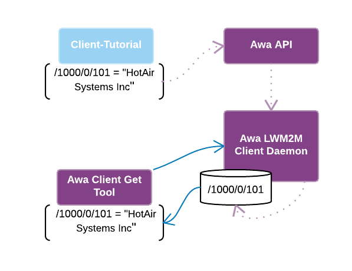
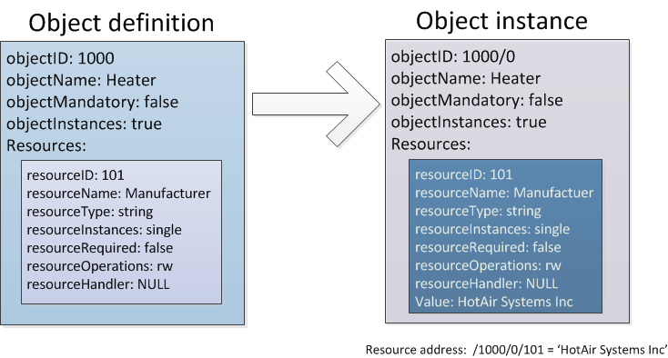

----


# Awa LightweightM2M

## Example: Create a client application on a gateway device using the Awa API

### Application overview


This example shows how to:

* Compile and install Awa LightweightM2M
* Create the application *client-tutorial* which:
    * Initiates a client session
    * Defines an object
    * Defines a resource within the object
    * Instantiates the defined object within the client
    * closes the client session
    * Exits
* Enhance the initial application with the addition of another resource to the existing object
* Create a server side application which uses the same object model

The client-tutorial application makes use of the Awa API to define objects and resources and to register these with the client daemon:



Note that this example assumes you have downloaded and decompressed (or git-cloned) Awa LWM2M into the directory `~/AwaLWM2M`.

## Awa LightweightM2M installation

Use the command below to build and install Awa LightweightM2M to the  *./build/install* directory:

```
~/AwaLWM2M $ make install DESTDIR=install
```

Alternatively, you can use the following command to install into the default directory on your system:

```
~/AwaLWM2M $ sudo make install
```

This example will assume that you have installed it to `~/AwaLWM2M/build/install`.

----


## Creating the application


Now we create a new directory for the project. We'll use *tutorial*:

```
$ mkdir ~/tutorial
$ cd ~/tutorial
```

To create the makefile, copy the code below to tutorial/*Makefile*. Be sure to retain the ````<TAB>```` character preceding *$(CC) client-tutorial.c* :

```make
all:
	$(CC) client-tutorial.c -o client-tutorial -I$(AWA_INSTALL_PATH)/include -L$(AWA_INSTALL_PATH)/lib -lawa
```

Now is a good time to define our objects and resources:



To create the above object model the following code goes into tutorial/*client-tutorial.c*:

```c
#include <stdlib.h>
#include <stdio.h>

#include <awa/common.h>
#include <awa/client.h>

#define OPERATION_PERFORM_TIMEOUT 1000

static void DefineHeaterObject(AwaClientSession * session)
{
    AwaObjectDefinition * objectDefinition = AwaObjectDefinition_New(1000, "Heater", 0, 1);
    AwaObjectDefinition_AddResourceDefinitionAsString(objectDefinition, 101, "Manufacturer", false, AwaResourceOperations_ReadWrite, NULL);

    AwaClientDefineOperation * operation = AwaClientDefineOperation_New(session);
    AwaClientDefineOperation_Add(operation, objectDefinition);
    AwaClientDefineOperation_Perform(operation, OPERATION_PERFORM_TIMEOUT);
    AwaClientDefineOperation_Free(&operation);
}

static void SetInitialValues(AwaClientSession * session)
{
    AwaClientSetOperation * operation = AwaClientSetOperation_New(session);

    AwaClientSetOperation_CreateObjectInstance(operation, "/1000/0");
    AwaClientSetOperation_CreateOptionalResource(operation, "/1000/0/101");
    AwaClientSetOperation_AddValueAsCString(operation, "/1000/0/101", "HotAir Systems Inc");

    AwaClientSetOperation_Perform(operation, OPERATION_PERFORM_TIMEOUT);
    AwaClientSetOperation_Free(&operation);
}

int main(void)
{
    AwaClientSession * session = AwaClientSession_New();

    AwaClientSession_Connect(session);

    DefineHeaterObject(session);
    SetInitialValues(session);

    AwaClientSession_Disconnect(session);
    AwaClientSession_Free(&session);
    return 0;
}
```

Now build the application...

```
~/tutorial$ make AWA_INSTALL_PATH=~/AwaLWM2M/build/install
```

Start the client daemon...

````
~/AwaLWM2M$ build/core/src/client/awa_clientd --endPointName client1 --factoryBootstrap ./config/localhost.bsc --daemonise --logFile /tmp/awa_clientd.log
````

And run the application...

Note that in this case *libawa.so* isn't in the library path. We'll tell the system where to find
 it by setting the *LD_LIBRARY_PATH* variable.

```
~/tutorial$ LD_LIBRARY_PATH=~/AwaLWM2M/build/install/lib ./client-tutorial
````

The application will then exit, leaving the new object/resource registered within the client daemon.

Use the client tool *awa-client-get* to read your newly defined resource:

```
~/AwaLWM2M/build/install/bin$ ./awa-client-get /1000/0/101
Heater[/1000/0]:
    Manufacturer[/1000/0/101]: HotAir Systems Inc
```

----


## Adding further resources

Further object resources are easily defined. Note that a resource's data type is implied by the API function used to create it, e.g. resource 101, (defined above), was of type string and thus used *AwaObjectDefinition_AddResourceDefinitionAsString()*. Our new resource, 104, will be of type float, so we'll use *AwaObjectDefinition_AddResourceDefinitionAsFloat()* to create it. Function parameters remain the same.

So our *client-tutorial.c* file now contains two additional lines:

In the *DefineHeaterObject()* function:

```c
AwaObjectDefinition_AddResourceDefinitionAsFloat(objectDefinition,  104, "Temperature", false, AwaResourceOperations_ReadWrite, 0.0);
```

This defines the new resource.

And in the *SetInitialValues()* function:

```c
AwaClientSetOperation_CreateOptionalResource(operation, "/1000/0/104");
    AwaClientSetOperation_AddValueAsCString(operation, "/1000/0/101", "HotAir Systems Inc");
```

Which instantiates the resource.

We've also added a function called *UpdateTemperature()* which accepts a float value *temperature* and writes it to the new resource, and a *while* loop in the *main()* function which accepts temperature values entered at the console, (to simulate actual sensor values from a device for example), and uses *UpdateTemperature()* to update the resource to the entered value.

Here's the updated application code:

```c
static void DefineHeaterObject(AwaClientSession * session)
{
    AwaObjectDefinition * objectDefinition = AwaObjectDefinition_New(1000, "Heater", 0, 1);
    AwaObjectDefinition_AddResourceDefinitionAsString(objectDefinition, 101, "Manufacturer", false, AwaResourceOperations_ReadWrite, NULL);
+   AwaObjectDefinition_AddResourceDefinitionAsFloat(objectDefinition,  104, "Temperature", false, AwaResourceOperations_ReadWrite, 0.0);

    AwaClientDefineOperation * operation = AwaClientDefineOperation_New(session);
    AwaClientDefineOperation_Add(operation, objectDefinition);
    AwaClientDefineOperation_Perform(operation, OPERATION_PERFORM_TIMEOUT);
    AwaClientDefineOperation_Free(&operation);
}

static void SetInitialValues(AwaClientSession * session)
{
    AwaClientSetOperation * operation = AwaClientSetOperation_New(session);

    AwaClientSetOperation_CreateObjectInstance(operation, "/1000/0");
    AwaClientSetOperation_CreateOptionalResource(operation, "/1000/0/101");
+   AwaClientSetOperation_CreateOptionalResource(operation, "/1000/0/104");
    AwaClientSetOperation_AddValueAsCString(operation, "/1000/0/101", "HotAir Systems Inc");

    AwaClientSetOperation_Perform(operation, OPERATION_PERFORM_TIMEOUT);
    AwaClientSetOperation_Free(&operation);
}

+static void UpdateTemperature(AwaClientSession * session, float temperature)
+{
+    AwaClientSetOperation * operation = AwaClientSetOperation_New(session);
+
+    AwaClientSetOperation_AddValueAsFloat(operation, "/1000/0/104", temperature);
+
+    AwaClientSetOperation_Perform(operation, OPERATION_PERFORM_TIMEOUT);
+    AwaClientSetOperation_Free(&operation);
+}

int main(void)
{
    AwaClientSession * session = AwaClientSession_New();

    AwaClientSession_Connect(session);

    DefineHeaterObject(session);
    SetInitialValues(session);

+   while (true)
+   {
+       float temperature;
+
+       printf("enter temperature or any other key to exit:");
+       if (scanf("%f", &temperature) == 0)
+       {
+           break;
+       }
+
+       UpdateTemperature(session, temperature);
+       printf("set temperature /1000/0/104 to %f\n", temperature);
+   }

    AwaClientSession_Disconnect(session);
    AwaClientSession_Free(&session);
    return 0;
}
```

After updating the application code, rebuild the application:

```
~/tutorial$ make AWA_INSTALL_PATH=~/AwaLWM2M/build/install
```

And restart the client daemon:

```
~/AwaLWM2M$ killall awa_clientd
~/AwaLWM2M$ build/core/src/client/awa_clientd --endPointName client1 --factoryBootstrap ./config/localhost.bsc --daemonise --logFile /tmp/awa_clientd.log
```

Then restart the client application and set the temperature...

```
~/tutorial$ LD_LIBRARY_PATH=~/AwaLWM2M/build/install/lib ./client-tutorial
enter temperature or any other key to exit:10.0
set temperature /1000/0/104 to 10.000000
enter temperature or any other key to exit:q
```

To check for success, use the client tools to read your newly defined resource:

```
~/AwaLWM2M/build/install/bin$ ./awa-client-get /1000/0/104
Heater[/1000/0]:
    Temperature[/1000/0/104]: 10
```

So far our object definitions have remained local to the client. The next section compliments our client application by extending our object definitions to the server.


----


## Creating a server application using the Awa API

Let's create a server side application that makes use of our new object.


The following code registers our object definition with the LWM2M server daemon, allowing it to communicate with any LWM2M clients that support the same object.

Create the file tutorial/*server-tutorial.c* which contains the following code:

```c
#include <stdlib.h>
#include <stdio.h>

#include <awa/common.h>
#include <awa/server.h>

#define OPERATION_PERFORM_TIMEOUT 1000

int main(void)
{
    AwaServerSession * session = AwaServerSession_New();

    AwaServerSession_Connect(session);

    AwaObjectDefinition * objectDefinition = AwaObjectDefinition_New(1000, "Heater", 0, 1);

    AwaObjectDefinition_AddResourceDefinitionAsString(objectDefinition, 101, "Manufacturer", false, AwaResourceOperations_ReadWrite, NULL);
    AwaObjectDefinition_AddResourceDefinitionAsFloat(objectDefinition,  104, "Temperature",  false, AwaResourceOperations_ReadWrite, 0.0);

    AwaServerDefineOperation * operation = AwaServerDefineOperation_New(session);
    AwaServerDefineOperation_Add(operation, objectDefinition);
    AwaServerDefineOperation_Perform(operation, OPERATION_PERFORM_TIMEOUT);
    AwaServerDefineOperation_Free(&operation);

    AwaServerSession_Disconnect(session);
    AwaServerSession_Free(&session);
    return 0;
}
```

Now update tutorial/Makefile to include *server-tutorial.c* like so:

```make
all:
        $(CC) client-tutorial.c -o client-tutorial -I$(AWA_INSTALL_PATH)/include -L$(AWA_INSTALL_PATH)/lib -lawa
        $(CC) server-tutorial.c -o server-tutorial -I$(AWA_INSTALL_PATH)/include -L$(AWA_INSTALL_PATH)/lib -lawa
```

Build the new application:

```
~/tutorial$ make AWA_INSTALL_PATH=~/AwaLWM2M/build/install
```

Restart the client/server daemon:

```
~/AwaLWM2M$ killall awa_serverd
~/AwaLWM2M$ killall awa_clientd
~/AwaLWM2M$ build/core/src/server/awa_serverd --verbose --daemonise --logFile /tmp/awa_serverd.log
~/AwaLWM2M$ build/core/src/client/awa_clientd --endPointName client1 --factoryBootstrap ./config/localhost.bsc --daemonise --logFile /tmp/awa_clientd.log
```

And start the server application:

```
~/tutorial$ LD_LIBRARY_PATH=~/AwaLWM2M/build/install/lib ./server-tutorial
```

Now start client client application:

```
~/tutorial$ LD_LIBRARY_PATH=~/AwaLWM2M/build/install/lib ./client-tutorial
```

Use the server tool *awa-server-list-clients* to check that the client is registered with the server (look for object /1000/0 ):

```
./awa-server-list-clients --objects
Client: client1
  /1/0     LWM2MServer
  /2/0     LWM2MAccessControl
  /2/1     LWM2MAccessControl
  /2/2     LWM2MAccessControl
  /2/3     LWM2MAccessControl
  /3/0     Device
  /4/0     ConnectivityMonitoring
  /7       ConnectivityStatistics
  /5/0     FirmwareUpdate
  /6/0     Location
  /1000/0  Heater
```

Read from the new resource using the server tool *awa-server-read*:

```
~/AwaLWM2M/build/install/bin$ ./awa-server-read -c client1 /1000/0/104
Heater[/1000/0]:
    Temperature[/1000/0/104]: 10
```

Alternatively you can read entire objects or object instances:

```
~/AwaLWM2M/build/install/bin$ ./awa-server-read -c client1 /1000
Heater[/1000/0]:
    Manufacturer[/1000/0/101]: HotAir Systems Inc
    Temperature[/1000/0/104]: 10

~/AwaLWM2M/build/install/bin$ ./awa-server-read -c client1 /1000/0
Heater[/1000/0]:
    Manufacturer[/1000/0/101]: HotAir Systems Inc
    Temperature[/1000/0/104]: 10
```

## Example: Create a server event application using the Awa API

This example will demonstrate how to build a standalone application using the Awa Server API. This application will receive events from the LWM2M server for client registrations.

The complete version of this example can be found in *examples/server-event-example.c*. This also contains event handlers for Client Deregister and Client Update events, and uses the callback *context* to pass application data to each callback.

Note that this example omits error checking. This is for illustrative purposes only and application programmers should check return values for each API function call.

We start by setting up our API Session with the server, and connecting with the server's IPC. Before exiting, we should also disconnect and free any allocated memory:

```c
#include <stdlib.h>
#include <stdio.h>

#include <awa/server.h>

#define OPERATION_PERFORM_TIMEOUT (1000)

int main(void)
{
    AwaServerSession * session = AwaServerSession_New();
    AwaServerSession_Connect(session);

    AwaServerSession_Disconnect(session);
    AwaServerSession_Free(&session);
    return 0;
}
```

Add a loop that will run until CTRL-C is entered. This loop will provide the API a regular opportunity to service any incoming notifications, and run any associated callback functions:

```c
...
#include <stdio.h>
+#include <signal.h>
#include <awa/server.h>
...

+static bool stopFlag = false;
+static void stop(int ignore)
+{
+   stopFlag = true;
+}

int main(void)
{
+   signal(SIGINT, stop);

    AwaServerSession * session = AwaServerSession_New();
    AwaServerSession_Connect(session);

+   while (!stopFlag)
+   {
+       AwaServerSession_Process(session, OPERATION_PERFORM_TIMEOUT);
+       AwaServerSession_DispatchCallbacks(session);
+   }

    AwaServerSession_Disconnect(session);
    AwaServerSession_Free(&session);
    return 0;
}
```

Add a callback that will be called whenever a client registers with the server, by passing the callback's function pointer to `AwaServerSession_SetClientRegisterEventCallback()`. An optional context pointer
may be provided which will be passed to the callback function automatically. It is not used in this example.

```c
...

+static void clientRegisterCallback(const AwaServerClientRegisterEvent * event, void * context)
+{
+   printf("Client registered!\n");
+}

int main(void)
{
    signal(SIGINT, stop);

    AwaServerSession * session = AwaServerSession_New();
    AwaServerSession_Connect(session);

+   AwaServerSession_SetClientRegisterEventCallback(session, clientRegisterCallback, NULL);

    while (!stopFlag)
    {
        AwaServerSession_Process(session, OPERATION_PERFORM_TIMEOUT);
        AwaServerSession_DispatchCallbacks(session);
    }

    AwaServerSession_Disconnect(session);
    AwaServerSession_Free(&session);
    return 0;
}
```

At this point, you should be able to build this application and run it with an Awa LWM2M server daemon using the default IPC configuration. When you start an Awa LWM2M client and have it register with your server, the application should print out "Client registered!".

The next step is to determine the name (ID) of the newly registered client and use this to print out the registered entities, which are the registered objects and object instances managed by the client. An event may contain information for more than one client, so multiple client names (IDs) may be available in a single event. Client names are obtained from an `AwaClientIterator`. As used elsewhere in the API, an `AwaClientIterator` can be passed to `AwaClientIterator_Next()` to obtain the next entry, and each client name is then returned by `AwaClientIterator_GetClientID()`.

Once we have a client name, we can use this to obtain the list of registered LWM2M entities (objects and object instances) for this client. This is done by using an `AwaRegisteredEntityIterator`, which behaves in a similar way to `AwaClientIterator`. The entity *paths* are returned by `AwaRegisteredEntityIterator_GetPath()`. These are strings in the form of `/3` or `/3/0` where `3` is the Object ID and `0` is the Object Instance ID.

```c
...
static void clientRegisterCallback(const AwaServerClientRegisterEvent * event, void * context)
{
-   printf("Client registered!\n");
+   AwaClientIterator * clientIterator =
+          AwaServerClientRegisterEvent_NewClientIterator(event);
+
+   while (AwaClientIterator_Next(clientIterator))
+   {
+       const char * clientID =  AwaClientIterator_GetClientID(clientIterator);
+       printf("Client %s registered!\n", clientID);
+       AwaRegisteredEntityIterator * entityIterator =
+           AwaServerClientRegisterEvent_NewRegisteredEntityIterator(event, clientID);
+       while (AwaRegisteredEntityIterator_Next(entityIterator))
+       {
+           printf(" %s", AwaRegisteredEntityIterator_GetPath(entityIterator));
+       }
+       printf("\n");
+   }
+   AwaRegisteredEntityIterator_Free(&entityIterator);
}
...
```

The application should now print the name of each registering client and the list of registered entity paths.

----
----
