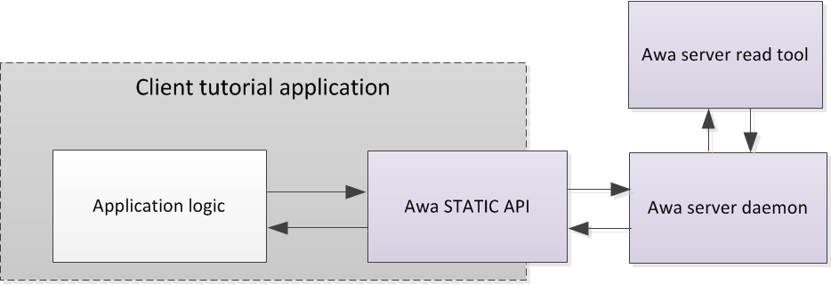
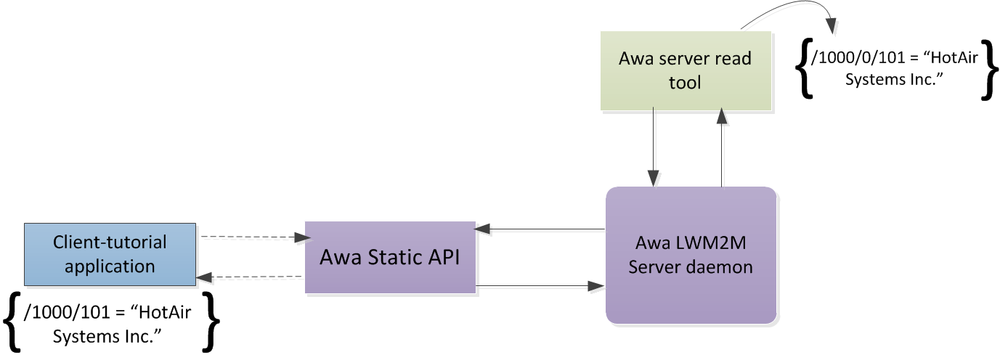

----


# Awa LightweightM2M  

## Example: Create a client application on a device using the Awa API  

### Application overview



This example shows how to:

* Create the application *client-static-tutorial* in a Linux environment which:
    * Defines an object
    * Defines a resource within the object
    * Instantiates the defined object within the client
* Create the above application *client-static-tutorial* in a Contiki simulated environment.
* Use the Server daemon tools to create the same object model and read/write resources in the *client-static-tutorial* application.

The *client-static-tutorial* application makes use of the Awa Static API to define objects and resources and to expose them via LWM2M:



Note that this example assumes you have downloaded and decompressed (or git-cloned) Awa LWM2M into the directory `~/AwaLWM2M`.

## Awa LightweightM2M installation  

Use the command below to build and install Awa LightweightM2M to the  *./build/install* directory:

```
~/AwaLWM2M $ make install DESTDIR=install
```

Alternatively, you can use the following command to install into the default directory on your system:

```
~/AwaLWM2M $ sudo make install
```

This example will assume that you have installed it to `~/AwaLWM2M/build/install`.

----


## Example: Create a standalone LWM2M client for a Linux environment using the Awa Static API.

This example will demonstrate how to build a standalone LWM2M client using the Awa Static API.

Create a new directory *static-client-tutorial*:

```
$ mkdir static-client-tutorial
```

Copy the following code into static-client-tutorial/*Makefile*:

```make
all:
	$(CC) static-client-tutorial.c -o static-client-tutorial -I$(AWA_INSTALL_PATH)/include -L$(AWA_INSTALL_PATH)/lib -lawa_static
```

Copy the following code into static-client-tutorial/*static-client-tutorial.c*:

```c
#include <string.h>
#include <stdio.h>
#include "awa/static.h"

int main(void)
{
    AwaFactoryBootstrapInfo bootstrapinfo = { 0 };
    AwaStaticClient * awaClient = AwaStaticClient_New();

    AwaStaticClient_SetLogLevel(AwaLogLevel_Error);
    AwaStaticClient_SetEndPointName(awaClient, "AwaStaticClient1");
    AwaStaticClient_SetCoAPListenAddressPort(awaClient, "::", 6000);
    AwaStaticClient_SetBootstrapServerURI(awaClient, "");

    AwaStaticClient_Init(awaClient);
    
    sprintf(bootstrapinfo.SecurityInfo.ServerURI, "%s", "coap://[::1]:5683");
    bootstrapinfo.SecurityInfo.SecurityMode = AwaSecurityMode_NoSec;
    sprintf(bootstrapinfo.SecurityInfo.PublicKeyOrIdentity, "[PublicKey]");
    sprintf(bootstrapinfo.SecurityInfo.SecretKey, "[SecretKey]");

    bootstrapinfo.ServerInfo.Lifetime = 60;
    bootstrapinfo.ServerInfo.DefaultMinPeriod = 1;
    bootstrapinfo.ServerInfo.DefaultMaxPeriod = -1;
    bootstrapinfo.ServerInfo.DisableTimeout = 86400;
    bootstrapinfo.ServerInfo.Notification = false;
    sprintf(bootstrapinfo.ServerInfo.Binding, "U");
    
    AwaStaticClient_SetFactoryBootstrapInformation(awaClient, &bootstrapinfo);

    while (1)
    {
        AwaStaticClient_Process(awaClient);
    }

    AwaStaticClient_Free(&awaClient);

    return 0;
}
```

Run "make" and specify the path to the static-client-tutorial and install path to Awa LWM2M:

```
$ make -C static-client-tutorial AWA_INSTALL_PATH=../build/install
```

Start the server:

```
$ ./build/install/bin/awa_serverd --interface lo --addressFamily 6 --ip ::1 --port 5683 &
```

Run your new application:

```
$ LD_LIBRARY_PATH=./build/install/lib static-client-tutorial/static-client-tutorial &
```

Query the server for connected clients:

```
$ ./build/install/bin/awa-server-list-clients -o
Client: AwaStaticClient1
  /2/0     LWM2MAccessControl
  /2/1     LWM2MAccessControl
  /2/2     LWM2MAccessControl
  /2/3     LWM2MAccessControl
  /1/0     LWM2MServer
```

### Add a custom object using the Awa static API  

The following code expands on the previous example, by demonstrating how to add a custom object - the "heater" object

```c
#include <string.h>
#include <stdio.h>
#include "awa/static.h"

+#define HEATER_INSTANCES 1

+typedef struct
+{
+    char Manufacturer[64];
+    AwaFloat Temperature;
+
+} HeaterObject;

+static HeaterObject heater[HEATER_INSTANCES];

+static void DefineHeaterObject(AwaStaticClient * awaClient)
+{
+    AwaStaticClient_DefineObject(awaClient, 1000, "Heater", 0, HEATER_INSTANCES);
+    AwaStaticClient_DefineResource(awaClient, 1000, 101, "Manufacturer", AwaResourceType_String, 0, 1, AwaResourceOperations_ReadOnly);
+    AwaStaticClient_SetResourceStorageWithPointer(awaClient, 1000, 101, &heater[0].Manufacturer, sizeof(heater[0].Manufacturer), sizeof(heater[0]));
+    AwaStaticClient_DefineResource(awaClient, 1000, 104, "Temperature",  AwaResourceType_Float, 0, 1, AwaResourceOperations_ReadOnly);
+    AwaStaticClient_SetResourceStorageWithPointer(awaClient, 1000, 104, &heater[0].Temperature, sizeof(heater[0].Temperature), sizeof(heater[0]));
+}

+static void SetInitialValues(AwaStaticClient * awaClient)
+{
+    int instance = 0;
+
+    AwaStaticClient_CreateObjectInstance(awaClient, 1000, instance);
+
+    AwaStaticClient_CreateResource(awaClient, 1000, instance, 101);
+    strcpy(heater[instance].Manufacturer, "HotAir Systems Inc");
+
+    AwaStaticClient_CreateResource(awaClient, 1000, instance, 104);
+    heater[instance].Temperature = 0.0;
+}

int main(void)
{
    AwaFactoryBootstrapInfo bootstrapinfo = { 0 };
    AwaStaticClient * awaClient = AwaStaticClient_New();

    AwaStaticClient_SetLogLevel(AwaLogLevel_Error);
    AwaStaticClient_SetEndPointName(awaClient, "AwaStaticClient1");
    AwaStaticClient_SetCoAPListenAddressPort(awaClient, "::", 6000);
    AwaStaticClient_SetBootstrapServerURI(awaClient, "");

    AwaStaticClient_Init(awaClient);
    
    sprintf(bootstrapinfo.SecurityInfo.ServerURI, "%s", "coap://[::1]:5683");
    bootstrapinfo.SecurityInfo.SecurityMode = AwaSecurityMode_NoSec;
    sprintf(bootstrapinfo.SecurityInfo.PublicKeyOrIdentity, "[PublicKey]");
    sprintf(bootstrapinfo.SecurityInfo.SecretKey, "[SecretKey]");

    bootstrapinfo.ServerInfo.Lifetime = 60;
    bootstrapinfo.ServerInfo.DefaultMinPeriod = 1;
    bootstrapinfo.ServerInfo.DefaultMaxPeriod = -1;
    bootstrapinfo.ServerInfo.DisableTimeout = 86400;
    bootstrapinfo.ServerInfo.Notification = false;
    sprintf(bootstrapinfo.ServerInfo.Binding, "U");
    
    AwaStaticClient_SetFactoryBootstrapInformation(awaClient, &bootstrapinfo);

+   DefineHeaterObject(awaClient);
+   SetInitialValues(awaClient);

    while (1)
    {
        AwaStaticClient_Process(awaClient);

+       //heater[0].Temperature = value from hardware
+       AwaStaticClient_ResourceChanged(awaClient, 1000, 0, 104);
    }

    AwaStaticClient_Free(&awaClient);

    return 0;
}

```

So far our object definitions have remained local to the client. The next section compliments our client application by extending our object definitions to the server.

----

## Using the Awa Server Daemon tools to request information from the Static client example application

Use the server define tool to define the object model for the "heater" object in the static client example application

```
$ build/install/bin/awa-server-define --objectID=1000 --objectName=Heater \
--resourceID=101 --resourceName=Manufacturer --resourceType=string --resourceOperations=r --resourceRequired=o --resourceInstances=single \
--resourceID=104 --resourceName=Temperature --resourceType=float --resourceOperations=r --resourceRequired=o --resourceInstances=single
```

Use the server tool *awa-server-list-clients* to check that the client is registered with the server (look for object /1000/0 ):

```
$ build/install/bin/awa-server-list-clients --objects
Client: client1
  /1/0     LWM2MServer
  /2/0     LWM2MAccessControl
  /2/1     LWM2MAccessControl
  /2/2     LWM2MAccessControl
  /2/3     LWM2MAccessControl
  /3/0     Device
  /4/0     ConnectivityMonitoring
  /7       ConnectivityStatistics
  /5/0     FirmwareUpdate
  /6/0     Location
  /1000/0  Heater
```

Read from the new resource using the server tool *awa-server-read*:

```
$ build/install/bin/awa-server-read -c AwaStaticClient1 /1000/0/104
Heater[/1000/0]:
    Temperature[/1000/0/104]: 0
```

Alternatively you can read entire objects or object instances:

```
$ build/install/bin/awa-server-read -c AwaStaticClient1 /1000
Heater[/1000/0]:
    Manufacturer[/1000/0/101]: HotAir Systems Inc
    Temperature[/1000/0/104]: 10

$ build/install/bin/awa-server-read -c AwaStaticClient1 /1000/0
Heater[/1000/0]:
    Manufacturer[/1000/0/101]: HotAir Systems Inc
    Temperature[/1000/0/104]: 10
```

## Example: Create a standalone LWM2M client within a contiki environment  

Awa LWM2M includes a number of makefiles to allow it to be compiled out of tree
for a contiki environment.

The following instructions act as an example of how to build a LWM2M client for contiki.

*Note: In this case we will use the contiki simulated environment, hardware specific configuration
 is outside of the scope of this tutorial*

Create a new directory *contiki-example*:

```
$ mkdir contiki-example
```

Clone AwaLWM2M and contiki into this directory:

```
$ cd contiki-example
contiki-example$ git clone https://github.com/FlowM2M/AwaLWM2M.git
contiki-example$ git clone https://github.com/contiki-os/contiki.git

contiki-example$ ls
AwaLWM2M
contiki
```

Build Awa (the linux awa server will be needed later)

```
contiki-example$ (cd AwaLWM2M/; make install DESTDIR=install)
```

Copy the following code into contiki-example/*Makefile*:

```make
CONTIKI_PROJECT=static-client-tutorial
CONTIKI=contiki
LWM2M_DIR=AwaLWM2M

CFLAGS += -Wall -Wno-pointer-sign
CFLAGS += -I$(LWM2M_DIR)/api/include -DLWM2M_CLIENT

CFLAGS += -DUIP_CONF_BUFFER_SIZE=4096
CFLAGS += -DREST_MAX_CHUNK_SIZE=512

APPS += er-coap
APPS += rest-engine

APPDIRS += $(LWM2M_DIR)/core/src
APPS += client
APPS += common

CONTIKI_WITH_IPV6 = 1
CONTIKI_WITH_RPL = 0

all: static-client-tutorial

include $(CONTIKI)/Makefile.include
```

Copy the following code to contiki-example/*static-client-tutorial.c*:

```c
#include <string.h>
#include <stdio.h>
#include "contiki.h"
#include "awa/static.h"

#define HEATER_INSTANCES 1

typedef struct
{
    char Manufacturer[64];
    AwaFloat Temperature;

} HeaterObject;

static HeaterObject heater[HEATER_INSTANCES];

static void DefineHeaterObject(AwaStaticClient * awaClient)
{
    AwaStaticClient_DefineObject(awaClient, 1000, "Heater", 0, HEATER_INSTANCES);
    AwaStaticClient_DefineResource(awaClient, 1000, 101, "Manufacturer", AwaResourceType_String, 0, 1, AwaResourceOperations_ReadOnly);
    AwaStaticClient_SetResourceStorageWithPointer(awaClient, 1000, 101, &heater[0].Manufacturer, sizeof(heater[0].Manufacturer), sizeof(heater[0]));
    AwaStaticClient_DefineResource(awaClient, 1000, 104, "Temperature", AwaResourceType_Float, 0, 1, AwaResourceOperations_ReadOnly);
    AwaStaticClient_SetResourceStorageWithPointer(awaClient, 1000, 104, &heater[0].Temperature, sizeof(heater[0].Temperature), sizeof(heater[0]));
}

static void SetInitialValues(AwaStaticClient * awaClient)
{
    int instance = 0;

    AwaStaticClient_CreateObjectInstance(awaClient, 1000, instance);

    AwaStaticClient_CreateResource(awaClient, 1000, instance, 101);
    strcpy(heater[instance].Manufacturer, "HotAir Systems Inc");

    AwaStaticClient_CreateResource(awaClient, 1000, instance, 104);
    heater[instance].Temperature = 0.0;
}

PROCESS(lwm2m_client, "Awa LWM2M Example Client");
AUTOSTART_PROCESSES(&lwm2m_client);

PROCESS_THREAD(lwm2m_client, ev, data)
{
    PROCESS_BEGIN();
    
    static AwaFactoryBootstrapInfo bootstrapinfo = { 0 };
    static AwaStaticClient * awaClient;
    
    awaClient = AwaStaticClient_New();

    AwaStaticClient_SetLogLevel(AwaLogLevel_Error);
    AwaStaticClient_SetEndPointName(awaClient, "AwaStaticClient1");
    AwaStaticClient_SetCoAPListenAddressPort(awaClient, "::", 6000);
    AwaStaticClient_SetBootstrapServerURI(awaClient, "coap://[2001::1]:15683");

    AwaStaticClient_Init(awaClient);
    
    sprintf(bootstrapinfo.SecurityInfo.ServerURI, "%s", "coap://[2001::1]:5683");
    bootstrapinfo.SecurityInfo.SecurityMode = AwaSecurityMode_NoSec;
    sprintf(bootstrapinfo.SecurityInfo.PublicKeyOrIdentity, "[PublicKey]");
    sprintf(bootstrapinfo.SecurityInfo.SecretKey, "[SecretKey]");

    bootstrapinfo.ServerInfo.Lifetime = 60;
    bootstrapinfo.ServerInfo.DefaultMinPeriod = 1;
    bootstrapinfo.ServerInfo.DefaultMaxPeriod = -1;
    bootstrapinfo.ServerInfo.DisableTimeout = 86400;
    bootstrapinfo.ServerInfo.Notification = false;
    sprintf(bootstrapinfo.ServerInfo.Binding, "U");
    
    AwaStaticClient_SetFactoryBootstrapInformation(awaClient, &bootstrapinfo);

    DefineHeaterObject(awaClient);
    SetInitialValues(awaClient);

    while (1)
    {
        static struct etimer et;
        static int waitTime;

        waitTime = AwaStaticClient_Process(awaClient);

        //heater[0].Temperature = value from hardware
        AwaStaticClient_ResourceChanged(awaClient, 1000, 0, 104);

        etimer_set(&et, (waitTime * CLOCK_SECOND) / 1000);
        PROCESS_YIELD();
        waitTime = 0;
    }

    AwaStaticClient_Free(&awaClient);

    PROCESS_END();
}
```

Build your contiki application:

```
contiki-example$ make TARGET=minimal-net
```

Run the contiki minimal-net application:

```
contiki-example$ sudo ./static-client-tutorial.minimal-net
```

----
----
