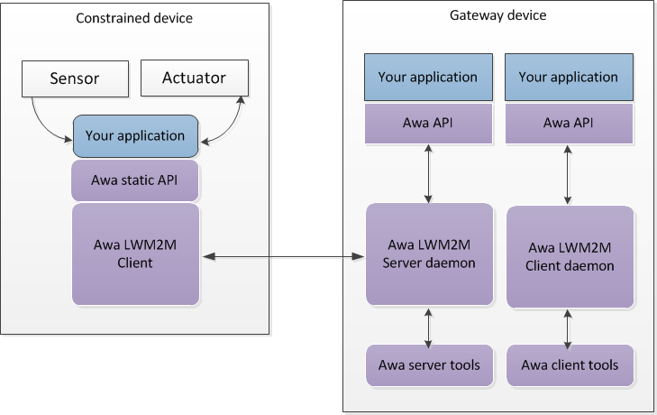
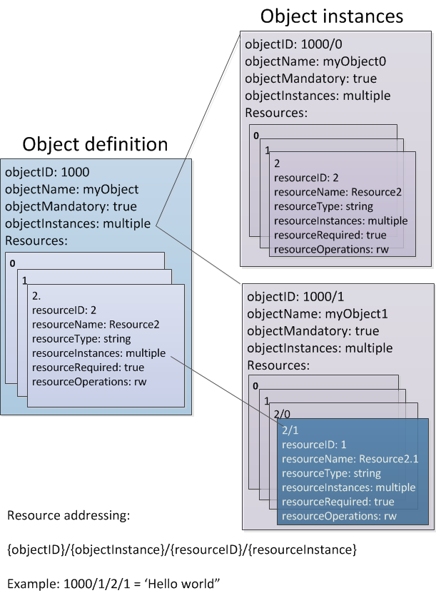
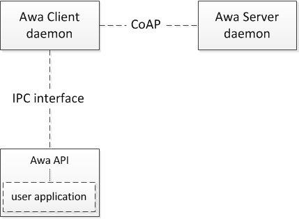
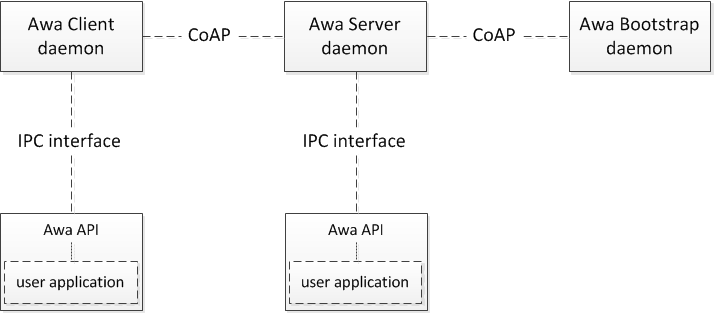
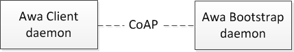

----

# Awa LightweightM2M. 

## User guide.

This document is aimed at application developers who are using the Awa LightweightM2M libraries and tools as a foundation, or enhancement of their own M2M applications.

Developers who aim to contribute to the Awa LightweightM2M project are referred to the [contributor guide](../CONTRIBUTING.md) and the [developer guide](developer_guide.md).

----


### Contents.

* [Introduction.](userguide.md#introduction) 
* [The LWM2M object model.](userguide.md#the-lwm2m-object-model) 
* [The LWM2M client.](userguide.md#the-lwm2m-client)  
    * [The Awa client daemon.](userguide.md#the-awa-client-daemon)  
    * [Using the LWM2M client.](userguide.md#using-the-LWM2M-client)
    * [The Awa API.](userguide.md#the-awa-api)
    * [Awa client API tools.](userguide.md#awa-client-api-tools)
        * [API options.](userguide.md#common-options)
        * [Creating a new object definition.](userguide.md#creating-a-new-object-definition)
        * [Discovering a device's object and resource definitions.](userguide.md#discovering-a-device's-object-and-resource-definitions)
        * [Setting resource values.](userguide.md#setting-resource-values)
        * [Retrieving a resource value.](userguide.md#retrieving-a-resource-value)
        * [Subscribing to a change of resource value.](userguide.md#subscribing-to-a-change-of-resource-value)
        * [Deleting a resource.](userguide.md#deleting-a-resource)
* [The LWM2M server.](userguide.md#the-lwm2m-server)  
    * [The Awa server daemon.](userguide.md#the-awa-server-daemon) 
    * [Awa server API tools.](userguide.md#awa-server-api-tools)
        * [Listing registered clients.](userguide.md#listing-registered-clients)
        * [Creating a server object definition.](userguide.md#creating-a-server-object-definition)
        * [Writing a value to a resource on a registered client.](userguide.md#writing-a-value-to-a-resource-on-a-registered-client)
        * [Reading a resource value from a registered client.](userguide.md#reading-a-resource-value-from-a-registered-client)
        * [Deleting an object instance from a registered client.](userguide.md#deleting-an-object-instance-from-a-registered-client)
        * [Observing a resource on a registered client.](userguide.md#observing-a-resource-on-a-registered-client)
        * [Executing a resource on a registered client.](userguide.md#executing-a-resource-on-a-registered-client)
        * [Write attribute values of a resource or object instance on a registered client.](userguide.md#write-attribute-values-of-a-resource-or-object-instance-on-a-registered-client)
* [The LWM2M Bootstrap server.](userguide.md#the-lwm2m-bootstrap-server) 
    * [The Awa bootstrap server daemon.](userguide.md#the-awa-bootstrap-server-daemon)  
* [Application example.](userguide.md#application-example)  
* [Awa API reference.](userguide.md#awa-api-reference)

----

### Introduction  





LWM2M is a protocol that allows resources on a client to be accessed by a server. In the Awa library both the client and the server are daemon processes, each having its own respective API interface over an inter-process communication interface (IPC). The client API is for use exclusively with the client daemon, and the server API is for use exclusively with the server daemon.  
A suite of tools is also provided to exercise the main functionality of the API for both the client and server. Later sections describe the configuration of the Awa client and server daemons, along with examples of tools use.

A bootstrap server daemon is included that implements the LWM2M bootstrapping protocol to instruct LWM2M clients which LWM2M management server to connect to. Later sections describe the configuration of the Awa bootstrap server.

### The LWM2M object model  

----



----


LWM2M is based on an object model such that:
* An object is defined to represent a device or client application, or a LWM2M device management function. 
* Each object is defined on both the client and the server.
* The client hosted object holds the current status of the device and resources are mapped directly to device functions (e.g. temperature sensor or tilt switch). 
* The server hosted object reflects a device's status on the server. The server has the tools to query resource values for any client directly. 
* One or more instances of an object may exist simultaneously but each will have a unique instance identifier.
* An object is composed of one or more resources, grouped under a single object identifier.
* Each resource is fully described and is uniquely addressable within the object.
* The OMA has pre-defined objects suitable for most cases, but custom objects may still be defined for local use. 
* One or more instances of a resource may exist simultaneously within an object but each will have a unique instance identifier.

Object and resource identifiers are 16 bit integers.

A resource instance is accessed via its parent object instance using a semantic approach:

````{objectID}/{object instance}/{resource ID}/{resource instance}````

In the case where a single instance of an object and resource exists the address resolves to ````{objectID}/{ResourceID}````

Semantic addressing allows resources to be written to directly: ````1000/0/1/2='this value"````

[Back to the table of contents](userguide.md#contents)

----


### The LWM2M client  

The LWM2M Client runs as a daemon and provides the core LWM2M functionality for:

* Bootstrapping  
* Registration  
* Device management and service enablement  
* Information reporting

The client provides two interfaces:  

* A CoAP interface to talk to the LWM2M server  
* An IPC interface which provides a mechanism for applications to talk to the daemon  





The IPC interface allows the end user application to define new objects and to perform Get/Set/Delete/Subscribe operations on the client.  
Currently the IPC interface is implemented as a simple UDP channel, with an associated UDP port. It is recommended that only a single user application connect to the daemon's IPC interface at any time.


### The Awa client daemon  

Usage: ````awa_clientd [options] [--bootstrap [URI] | --factoryBootstrap [filename]] ````


| options | description |
|-----|-----|
| --port, -p |  port number for CoAP communications |  
| --ipcPort, -i |  port number for IPC communications |  
| --endPointName, -e | client end point name |  
| --bootstrap, -b  | bootstrap server URI |  
| --factoryBootstrap, -f | factory bootstrap information file |  
| --logFile, -l | log filename |  
| --daemonise, -d | run as daemon |  
| --verbose, -v | enable verbose output |  
| --help | show usage |

Example:

```` awa_clientd --port 6000 --endPointName client1 --bootstrap coap://0.0.0.0:2134 ````

[Back to the table of contents](userguide.md#contents)

----


### The LWM2M server  

The LWM2M server runs as a daemon which provides an interface to perform LWM2M operations on connected LWM2M clients.



The IPC interface allows the end user application to define new objects, list registered clients and perform Read/Write/Delete/Observe operations for a given LWM2M client registered with the server.  
Currently the IPC interface is implemented as a simple UDP channel, with an associated UDP port. It is recommended that only a single user application connect to the daemon's IPC interface at any time.


### The Awa server daemon  

Usage: ````awa_serverd [options] ````

| options | description |
|-----|-----|
| --ip | IP address for server |  
| --interface | Network interface for server |  
| --addressFamily | Address family for network interface. 4 for IPv4, 6 for IPv6 |  
| --port, -p | port number for CoAP communications |  
| --ipcPort, -i | port number for IPC communications |  
| --contentType, -m | Content Type ID (default 1542 - TLV) |  
| --logFile | log filename |  
| --daemonise, -d | run as daemon |  
| --verbose, -v | enable verbose output |  
| --help | show usage |


Example: ````awa_serverd --interface eth0 --addressFamily 4 --port 5683 ````

For examples of how to use the LWM2M server with the LWM2M client see the *LWM2M client usage* section below.

[Back to the table of contents](userguide.md#contents)

----


### The LWM2M Bootstrap server  

The LWM2M Bootstrap server runs as a daemon which provides a mechanism to bootstrap LWM2M clients. 





### The Awa Bootstrap server daemon  

**Command line options.**  
 
A basic bootstrap server is supplied in the development suite which can be run on a local machine and used to re-direct the LWM2M client to any LWM2M server:

Usage: ````awa_bootstrapd [options] ````

| options | description |  
|-----|-----|  
| --ip | IP address for bootstrap server |  
| --interface | Network interface for bootstrap server |  
| --addressFamily | Address family for network interface. 4 for IPv4, 6 for IPv6 |  
| --port, -p | port number for CoAP communications |  
| --config, -c | config file (server list) |  
| --daemonize, -d | daemonize |  
| --verbose, -v | verbose debug output |  
| --logfile  | logfile name |  
| --help | show usage |  


Example: ````awa_bootstrapd --port 15685 --config bootstrap.conf ````


**The configuration file.**  

The configuration file must have the following format:
````
ServerURI=coap://127.0.0.2:5683
SecurityMode=0
PublicKey=[PublicKey]
SecretKey=[SecretKey]
ServerID=1
HoldOffTime=30
ShortServerID=1
Binding=U
LifeTime=30
DefaultMinimumPeriod=1
DefaultMaximumPeriod=-1
DisableTimeout=86400
NotificationStoringWhenDisabledOrOffline=true
````

 * *ServerURI* specifies the address and port of the LWM2M server to which clients will be directed.  
 * *SecurityMode* is not yet supported.  
 * *PublicKey* is not supported.  
 * *SecretKey* is not supported.  
 * *ServerID* specifies the numerical ID of the LWM2M server used to associate security and server objects on the LWM2M client.  
 * *HoldOffTime* is not yet supported.  
 * *ShortServerID* specifies the numerical ID of the LWM2M server used to associate Security and Server objects on the LWM2M client.  
 * Binding specifies the supported LWM2M binding modes for this server. Only "U" (UDP, non-queuing) is currently supported.  
 * *LifeTime* specifies the minimum time (in seconds) that the server will wait after receiving a registration or update from the client before terminating that registration.  
 * *DefaultMinimumPeriod* specifies the default minimum period of observations.  
 * *DefaultMaximumPeriod* specifies the default maximum period of observations, -1 represents an indefinite period.    
 * *DisableTimeout* is not supported.  
 * *NotificationStoringWhenDisabledOrOffline* is not supported.  

[Back to the table of contents](userguide.md#contents)

----


## Using the LWM2M client  


### Connecting the gateway client to the gateway LWM2M server.
````
$ build/core/src/bootstrap/awa_bootstrapd --verbose --port 15685
$ build/core/src/server/awa_serverd --verbose
$ build/core/src/client/awa_clientd --endPointName client1 --bootstrap coap://127.0.0.1:15685
````

### The Awa API  

The Awa API provides a way for applications to communicate with the LWM2M client and server daemons via the IPC interface.  
The client API header file can be found in "include/Awa/client.h".  
The server API header file can be found in "include/Awa/server.h".
Both server and client APIs are implemented in the *libawa* library. Applications may be linked against the either the static library *libawa.a* or the shared library *libawa.so*.

Useful examples can be found in the *api/example* folder. 

The tools directory contains a number of useful tools. By default these are built at the same time as the daemons.

[Back to the table of contents](userguide.md#contents)

## Awa client API tools  

Several command-line tools are available for user interaction with the LWM2M daemon. These tools support simple operations, such as defining a custom object type, setting a resource value, retrieving a resource value, and waiting for a resource to change or be executed. They interact with the LWM2M daemon via the SDK and IPC channel, and are applications that interact with the daemon locally.

Note that these are *not* LWM2M Protocol tools - they do not issue LWM2M operations.


### Common options  

Common options include:

| options | description |
|-----|-----|
| -h, --help | Print help and exit |  
| -V, --version | Print version and exit |  
| -v, --verbose | Increase program verbosity (shows more run-time information) |  
| -d, --debug | Increase program verbosity (shows a lot of run-time information) |  
| -a, --ipcAddress=ADDRESS | Connect to client daemon at address (default=`127.0.0.1') |  
| -p, --ipcPort=PORT | Connect to IPC port (default=`12345') |

*--ipcAddress* is used to specify the IP address of the client daemon to connect to.  
*--ipcPort* is used to specify the IPC port that the tool uses to communicate with the daemon. Both the daemon and the tool must use the same port. Changing the port allows users to run multiple instances of the client daemon on the same host.

Most tools take one or more PATH parameters, specified in the format:

| parameter | description |
|-----|-----|
| /O | specifies the object ID for operations on entire object types. |
| /O/I | specifies the object ID and object instance ID for operations on specific object instances. |
| /O/I/R | specifies the object ID, object instance ID, and resource ID for operations on specific resources. |  
| /O/I/R/i | specifies the object ID, object instance ID, resource ID and resource instance ID for operations on specific resource instances. |

For tools that write data, values can be specified with the format: ````PATH=VALUE````

[Back to the table of contents](userguide.md#contents)


### Creating a new object definition  

An *object* is a collection of individual *resources* bundled together under a single identifier, along with some extra attributes that describe the nature of the object (listed below). Numerous standard objects are pre-defined within the LWM2M model but additional custom objects may also be defined as needed. Custom objects are created by registering the new object definition with the daemon. The *awa-client-define* tool is used to perform this operation. Note that an object definition does not result in an object instance. Creation of an object instance is a separate process. Resource manipulation is only possible on object instances. 

**NOTE: A custom object must be defined for both the client *and* server daemons. Use the *awa-server-define* tool to define a custom object with the server.**

Firstly the object itself is defined by providing an ID, descriptive name, mandatory or optional flag (to determine whether the device must provide at least one instance), and whether the object supports single or multiple instances.

| object attribute | description |
|-----|-----|
| -o, --objectID=ID | Object ID |  
| -j, --objectName=NAME | Object name |  
| -m, --objectMandatory | Object is required or optional  (default=off) |  
| -y, --objectInstances=TYPE | Object supports single or multiple instances (possible values: *single* (default) or  *multiple*) |  

Secondly, each resource in the object is specified by a sequence of resource options:

| resource option | description |
|-----|-----|
| -r, --resourceID=ID |  Resource ID |  
| -n, --resourceName=NAME | Resource name |  
| -t, --resourceType=TYPE | Resource type ( possible values: *opaque, integer, float, boolean, string, time, objectlink, none*) | 
| -u, --resourceInstances=VALUE | Resource supports single or multiple instances (possible values: *single, multiple*) |  
| -q, --resourceRequired=VALUE | Resource is required or optional  (possible values: *optional, mandatory*) |  
| -k, --resourceOperations=VALUE | Resource operation  (possible values: *r, w, e, rw, rwe*) |  

**Note. For each *--resourceID* option, all other resource options must be specified.**

Example. Define TestObject2 as ObjectID 1000, with a single mandatory instance, and three resources:
````
./awa-client-define \
 --objectID=1000 --objectName=TestObject2 --objectMandatory --objectInstances=single \
 --resourceID=0 --resourceName=Resource0 --resourceType=string  --resourceInstances=single --resourceRequired=mandatory --resourceOperations=rw \
 --resourceID=1 --resourceName=Resource1 --resourceType=integer --resourceInstances=single --resourceRequired=mandatory --resourceOperations=rw \
 --resourceID=2 --resourceName=Resource2 --resourceType=none    --resourceInstances=single --resourceRequired=optiona   --resourceOperations=e
````

[Back to the table of contents](userguide.md#contents)

### Discovering a device's object and resource definitions  

The *awa-client-explore* tool is used to discover the objects and resources that have been defined on the LWM2M server. The tool will also list the objects and object-resources that are currently defined within the client daemon.

Example: ````./awa-client-explore ````

[Back to the table of contents](userguide.md#contents)

### Setting resource values  

The *awa-client-set* tool can be used to set the value of a resource.

Mandatory resources always exist provided that the parent *object instance* exists, thus before the value of any resource can be set, the object instance must first be created. Before an *optional resource* can be set, this resource must first be created.

Example. Consider the case where object /1000 has been defined but no instances have been created. The following can be used to create instance 0 of object 1000: ````./awa-client-set --create /1000/0 ````

Any mandatory resources associated with the object instance will also be instantiated with default values, but any resources defined as optional must be created explicitly before they can be set.

For example, to create an instance of the optional resource 0 within instance 0 of object 1000: ````./awa-client-set --create /1000/0/0 ````

Because no value is specified for the new resource instance, it will be created and populated with its default value.

Once the resource has been created, its value can be set.

For example, to set the value of resource 0 (which is of type string), within object instance 0 of object 1000, to the value *Happy*:

````./awa-client-set /1000/0/0=Happy ````

**Note that it is not possible to set the value of a resource that is of type *None*.**

A specific resource instance of a multi-instance resource can be set with: ````./awa-client-set /1000/0/1/7=Seventh ````

Multiple set operations can be combined on the command line:
 
 ````./awa-client-set --create /1000/0 /1000/0/0=Happy /1000/0/1/7=Seventh ````

[Back to the table of contents](userguide.md#contents)

### Retrieving a resource value  

The *awa-client-get* tool is used to retrieve the value of a client object resource and display it on the console.

For example, to retrieve and display the value of resource 0, within instance 0 of object 1000: ````./awa-client-get /1000/0/0 ````

Multiple resources can be retrieved: ````./awa-client-get /1000/0/1 /1000/0/5 ````

Entire object instances can be retrieved:  ````./awa-client-get /1000/0 ````

All object instances for an object ID can also be retrieved: ````./awa-client-get /1000 ````

If the resource specified is a multiple-instance resource, all instances will be retrieved. Individual instances can be displayed by specifying the resource instance index:  ````./awa-client-get /1000/0/5/1 /1000/0/5/2 ````

The *--quiet/-q* option can be used to suppress the display of any extra information.

[Back to the table of contents](userguide.md#contents)

### Subscribing to a change of resource value  

In some cases it may be important for a script to block until the value of a resource changes, or for an LWM2M resource execute operation to complete. The *awa-client-subscribe* tool can be used to act as a listener.

The *awa-client-subscribe* tool will display notifications whenever the value of the target resource or object instance changes, or when a target resource receives an execute operation. When a notification arrives, the details will be printed to the console.

Note that *awa-client-subscribe* is *not* the same a LWM2M *Observe* operation. This tool is listening to the local resource hosted by the client daemon.

For example, to listen for a change to resource 200 within instance 0 of object 1000: ````./awa-client-subscribe /1000/0/200 ````

To listen for a change to any resource within instance 0 of object 1000: ````./awa-client-subscribe /1000/0 ````

Listening for an LWM2M Execute operation is also possible, however the target object instance and resource must be fully specified. For example, to wait on resource 4, which is an executable resource of instance 0 of object 3: ````./awa-client-subscribe /3/0/4 ````

By default, *awa-client-subscribe* will wait indefinitely, displaying each notification as it arrives. With the time and count options, *awa_client-subscribe* can terminate after a number of notifications, or an elapsed period of time.

| option | description |
|-----|-----|
| -t, --waitTime=SECONDS | Time to wait for notification  (default=`0') |  
| -c, --waitCount=NUMBER | Number of notifications to wait for  (default=`0') | 


For example, to wait for no longer than 60 seconds for a single notification: ````./awa-client-subscribe /3/0/4 --waitTime=60 --waitCount=1 ````

Multiple paths can be combined on the command line: ````./awa-client-subscribe /3/0/4 /3/0/5 /4 ````

[Back to the table of contents](userguide.md#contents)

### Deleting a resource  

To delete an object or resource instance from the client, use the *awa-client-delete* tool.  
For example, to delete all object instances of object type 1000: ````./awa-client-delete /1000 ````

To delete the object instance of object type 1000 with ID 0: ````./awa-client-delete /1000/0 ````

To delete the resource with ID 5 from instance 0 of object ID 1000: ````./awa-client-delete /1000/0/5 ````

Unlike the *awa-server-delete* tool, this tool can modify the client's data structures directly, so is not limited by LWM2M Delete rules.

[Back to the table of contents](userguide.md#contents)


## Awa Server API tools  

Server tools are used to communicate with the LWM2M Server daemon and typically issue one or more LWM2M operations to a connected client.

Server tools often require a target client ID to be specified:

| option | description |
|-----|-----|
| -c, --clientID=ID | ClientID is the client endpoint name used by the client when registering with the LWM2M server. |


[Back to the table of contents](userguide.md#contents)

### Listing registered clients  

 The *awa-server-list-clients* tool can be used to list all clients currently registered with the LWM2M server daemon:

````./awa-server-list-clients ````

The *--clientID/-c* option is not required. Each client endpoint name is displayed, one per line.

If *--verbose/-v* is specified, the output shows the number of registered clients, and their client endpoint names:

For example: ````./awa-server-list-clients --verbose ````
    
Returns:
````
1 ClientA
2 ClientB
````

The option *--objects/-o* can be specified to retrieve and display the objects and object instances currently registered with the LWM2M server in the format ````<ObjectID>```` or ````<ObjectID/InstanceID>````. 

For example: ````./awa-server-list-clients --objects ````  
Returns
````
1 ClientA <2/0>,<4/0>,<7>,<3/0>,<5>,<6>,<0/1>,<1/1>
````

[Back to the table of contents](userguide.md#contents)


### Creating a server object definition  

The *awa-server-define* tool is used to define custom objects on the server. To use a custom object, the object definition must be registered with the server daemon. The *awa-server-define* tool has identical functionality to *awa-client-define*, described earlier.

[Back to the table of contents](userguide.md#contents)

### Writing a value to a resource on a registered client  

The *awa-server-write* tool is used to write the value of a resource on a registered client.

For example, to set the value of resource 0 (of type string) on the client "imagination1", within instance 0 of object 1000, to the value *Happy*:

````./awa-server-write --clientID=imagination1 /1000/0/0=Happy ````

Note that it is not possible to set the value of a resource that is of type *None*.

A multi-instance resource can be set by specifying the resource instances:

````./awa-server-write --clientID=imagination1 /1000/0/5/1=123 /1000/0/5/2=456````

To create a new instance of an object on a connected client, the *--create* option can be used. 
When an instance is created, any default values provided in the object definition are used.

For example, to create instance 1 of object 1000 on the client *imagination1*:

````./awa-server-write --clientID=imagination1 --create /1000/1 ````

To create a new instance with the next available object instance ID:

````./awa-server-write --clientID=imagination1 --create /1000 ````

The ID of the newly created object instance is displayed.

 **Note: Create functionality is not yet supported.**


[Back to the table of contents](userguide.md#contents)

### Reading a resource value from a registered client  

The *awa-server-read* tool is used to retrieve the value of a resource and display it on the console. For example, to display the value of resource 0, within instance 0 of object 1000:

````./awa-server-read --clientID=imagination1 /1000/0/0 ````

Multiple resources and object instances can be read using:

````./awa-server-read -c imagination1 /1000/0/2 /1000/0/3 /1000/1 /1001 ````


[Back to the table of contents](userguide.md#contents)

### Deleting an object instance from a registered client.

The *awa-server-delete* tool is used to delete an instance of an object from a connected client. For example, to delete object 1000, instance 0 from the client "imagination1":

````./awa-server-delete --clientID=imagination1 /1000/0 ````

**Note.** Due to LWM2M protocol restrictions it is not possible to delete individual resources, resource instances, or entire objects.


[Back to the table of contents](userguide.md#contents)

### Observing a resource on a registered client  

In some cases a script may be required to block until the value of a resource changes on a specific client. For this purpose, the *awa-server-observe* tool is provided to display notifications whenever the target resource or object instance changes. 

When a notification arrives, the details will be printed to the console, which is the functional equivalent of a LWM2M *Observe* operation.

For example, to wait for a change to resource 200 within instance 0 of object 1000:

````./awa-server-observe --clientID imagination1 /1000/0/200 ````

To wait for a change to any resource within instance 0 of object 1000:

````./awa-server-observe --clientID imagination1 /1000/0 ````

By default, *awa-server-observe* will wait indefinitely, displaying each notification as it arrives, but by using the time and count options, *awa-server-observe* can terminate after a number of notifications, or an elapsed period of time.

| option | description |
|-----|-----|
| -t, --waitTime=SECONDS | Time to wait for notification  (default=`0') |  
| -c, --waitCount=NUMBER | Number of notifications to wait for  (default=`0') |  

For example, to wait for no longer than 60 seconds for a single notification:

````./awa-server-observe --clientID imagination1 --waitTime=60 --waitCount=1 /1000/0/200 ````

Observe attributes that affect the way notifications are generated can be changed with the *awa-server-write-attributes* tool.


[Back to the table of contents](userguide.md#contents)

### Executing a resource on a registered client  

The *awa-server-execute* tool is used to initiate an *execute* operation on a resource that supports it.

For example, to initiate execution of object 1000, instance 0, resource 4 on the client "imagination1":

````./awa-server-execute --clientID imagination1 /1000/0/4 ````

Multiple operations can be initiated by applying multiple paths:

````./awa-server-execute --clientID imagination1 /1000/0/4 /1000/0/5 ````

Opaque data can be supplied as an argument to the execute operation by piping into the process via the *--stdin* option:

````./awa-server-execute --stdin --clientID imagination1 /1000/0/4 < mydata ````

**Note that the data supplied will be piped to all of the stated execute targets.**

Execute operations on an object, an object instance or a resource instance are not possible.


[Back to the table of contents](userguide.md#contents)


### Write attribute values of a resource or object instance on a registered client  

The *awa-server-write-attributes* tool is used to change the value of attributes associated with a client's resource or object instance.

For example, to set the *pmin* value of object 1000, instance 0, resource 4 on the client "imagination1" to 5 seconds:

````./awa-server-write_attributes --clientID imagination1 /1000/0/4\?pmin=5 ````

Multiple attribute values can be set with the same call. For example, to set the *pmin* attribute of object 1000, instance 0 on the client "imagination1" to 5 seconds, and *pmax* to 100 for the same object instance:

````./awa-server-write_attributes --clientID imagination1 /1000/0\?pmin=5\&pmax=100 ````

Note that the *?* and *&* characters will need to be escaped for most shells.

[Back to the table of contents](userguide.md#contents)


## Further information  

### Application example  

For an application example showing object and resource definitions on a client and a server, go [here](example_app.md).


### Awa API reference  

Full Awa API reference material is available [here](http://flowm2m.github.io/AwaLWM2M-docs/index.html).

### Connecting to third party servers  

A '*how to*' guide to connecting to Wakaama bootstrap and Eclipse Leshan servers is available [here](3rdparty.md).

[Back to the table of contents](userguide.md#contents)


----

----
